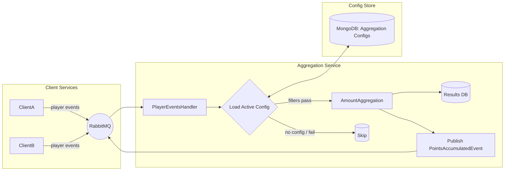

# OnAim.Aggregation

Event‑driven **aggregation service** for player activity (bets, deposits, etc.).
It consumes domain events from client services, evaluates them against dynamic, Mongo‑stored
**Aggregation Configurations**, and emits **points** to subscribers when thresholds are met.
A small **random producer** is included for local smoke tests, and Swagger is enabled for the API host.

---

## Solution layout

```
OnAim.Aggregation.sln
├─ OnAim.Aggregation.Api/             # ASP.NET Core minimal API host (Swagger)
├─ OnAim.Aggregation.Application/     # Application services, handlers, abstractions
├─ OnAim.Aggregation.Domain/          # Domain entities (AggregationConfig/Result/Rule, etc.)
├─ OnAim.Aggregation.Infrastructure/  # Messaging (IEventBus impl), CAP wiring, DI helpers
└─ OnAim.Aggregation.Persistence/     # Mongo (configs), Relational (results)
```

### Core components (code pointers)

- **Aggregation configuration service** — adds/updates configs via repository.
- **Amount aggregation** — accumulates amounts, awards points at thresholds, and publishes an aggregated event.
- **Player event subscribers** — consume player events, evaluate filters, aggregate, and persist in a transaction.
### Filter engine (DSL)

The filter engine accepts a list of `FilterClause` records:

- **Field** — dot‑path to a property inside the event; supports array indexes, e.g.  
  `Items[0].Amount`, `Metadata.extra.currency`
- **Op** — one of: `Eq`, `Ne`, `Gt`, `Lt`, `Regex`
- **Value** — stored as `BsonValue` and converted at runtime to the proper type  
  (supports `bool`, `string`, `int`, `decimal`, `DateTime`, arrays, and regex)

---

## How aggregation works

1. **Player event arrives** on its topic (e.g., `players.bet-placed`).
2. Service loads the **active config** for `(provider, eventType)` and **evaluates filters** on the event payload.
3. If passed, we **accumulate** the event's amount into the player’s `AggregationResult`.
4. For each reached **threshold**, we publish **PointsAccumulatedEvent** back to the subscriber and carry remainder forward.
5. The updated result is **persisted**.

### Threshold logic (amount → points)

- The algorithm keeps `AccumulatedAmount` and `TotalPoints` per `(player, provider, eventType, subscriberKey)`.
- Each time `AccumulatedAmount >= Rule.PointThreshold`, we emit points (`Rule.AwardPoints`), subtract the threshold, and continue until below threshold.
- This can emit multiple point events when one big amount crosses the threshold several times.

---

## Demo flow (what to show)

**Goal:** configuration → event emission → aggregation → subscriber notification

1) **Create config** for provider `RandomProvider`, topic `players.bet-placed`, SubscriberKey `RandomSubscriberKey` with:
   - Filters: e.g., `Currency == "USD"`, `Amount > 10`
   - Rule: `PointThreshold = 50`, `AwardPoints = 1`
2) **Emit player events** with previously configured provider
4) **Observe**:
   - Aggregated **result** for the player grows.
   - On each 50 aggregated amount, a **PointsAccumulatedEvent** is published with `Amount = 1`.
5) **Verify** via CAP dashboard / DB queries.

---

## Getting started

### Quick run (local)

Use the provided **docker-compose.yml** to spin up all required infra (RabbitMQ, MongoDB, PostgreSQL, Redis) with one command.

```bash
# from the repo root
docker compose up -d
```F

Infra that comes up:
- RabbitMQ → http://localhost:15672 (guest / guest)
- MongoDB → mongodb://localhost:27017
- Postgres → "Host=localhost;Port=5432;Database=aggdb;Username=agg;Password=aggpwd",

Then run the API locally (so it uses the host endpoints above):

```bash
dotnet run --project OnAim.Aggregation.Api
```

> Optional: copy **.env.example** to **.env** and map these values into your
> `appsettings.Development.json` or bind them via your configuration provider.

## Configuration model (example)

```jsonc
{
  "providerService": "ClientA",
  "subscriberService": "Rewards",
  "owner": "OpsTeam",
  "subscriberKey": "clientA-rewards",
  "eventType": "players.bet-placed",
  "filters": [
    { "field": "Currency", "op": "Eq", "value": "USD" },
    { "field": "Amount",   "op": "Gt", "value": 10 }
  ],
  "rule": { "pointThreshold": 50, "awardPoints": 1 },
  "isActive": true
}
```

> Filters support dot‑paths into the event (e.g., `Items[0].Amount`). The engine compares numbers/strings/datetimes with sensible coercions and supports `Regex` with options.

---

## Architecture (high‑level)



**Notes**
- Transport choice is abstracted behind `IEventBus` so you can swap RabbitMQ/Kafka.
- Configs live in Mongo; results in a relational DB for transactions and reporting.
- Add Redis when you need dedupe/idempotency or hot counters.

---
